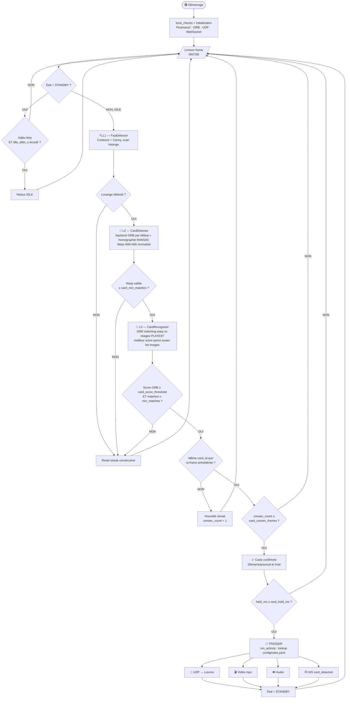
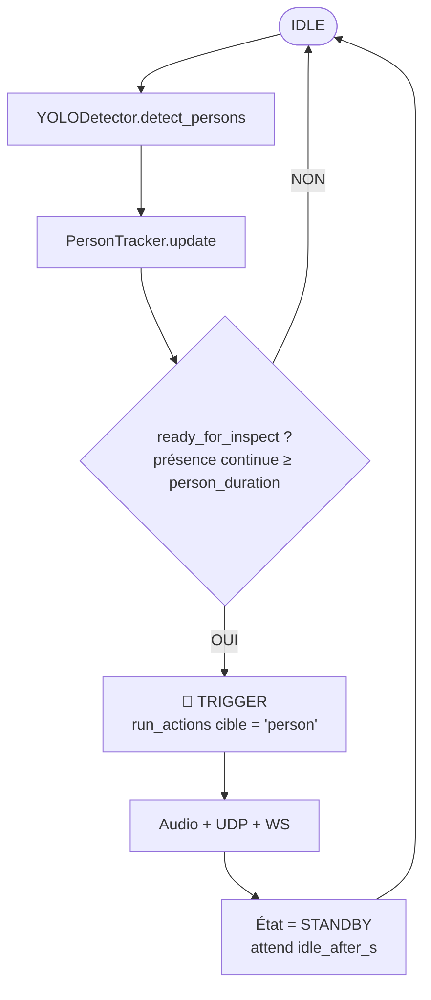
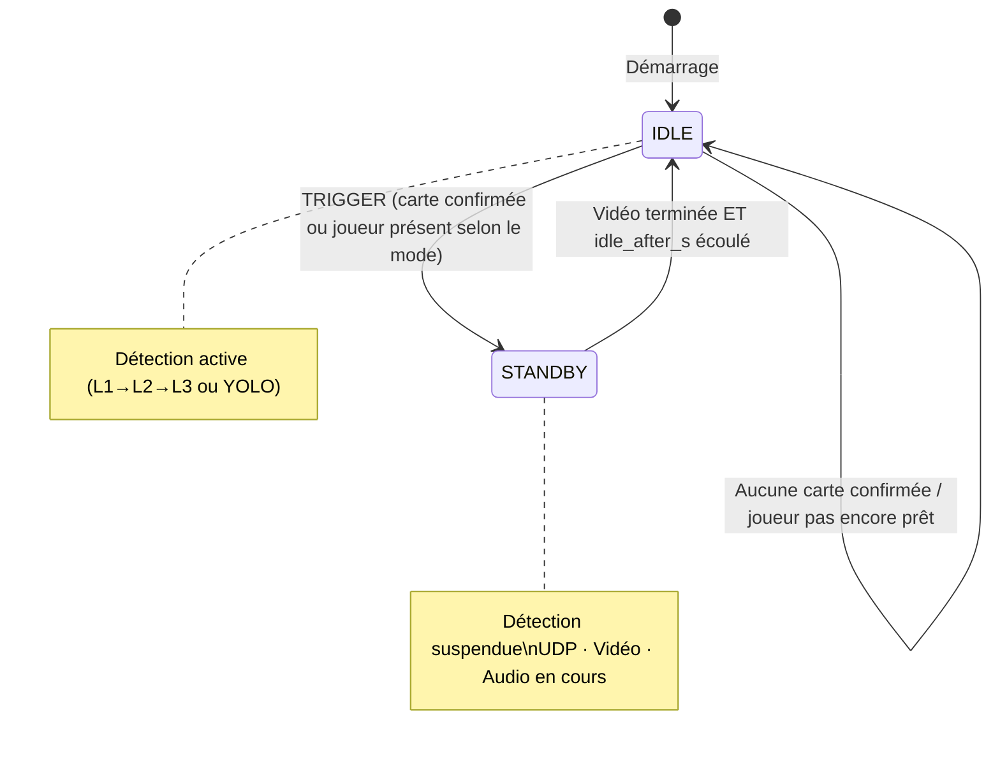
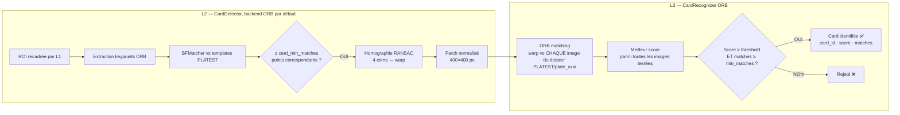
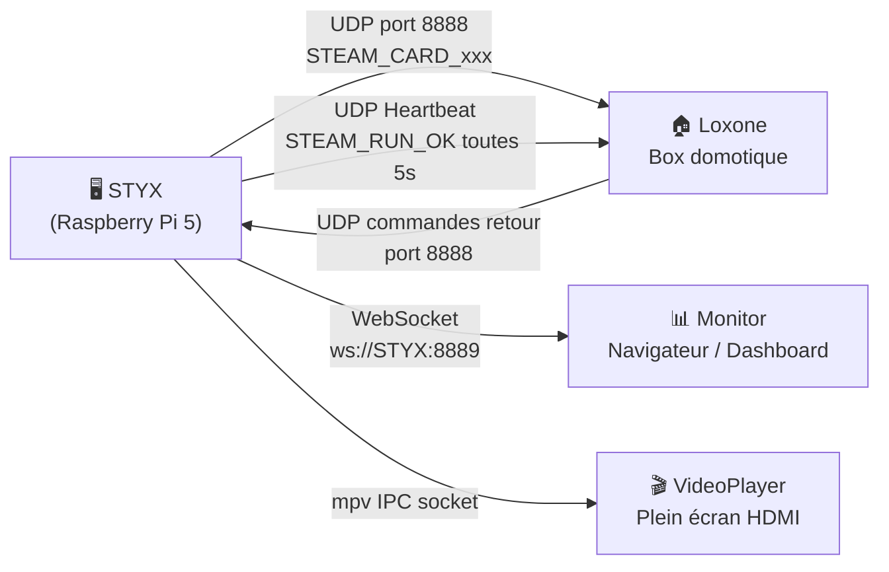
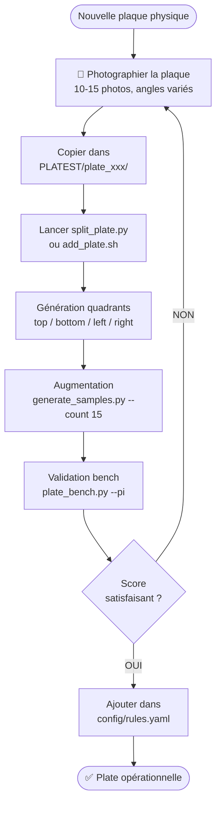

# Algorigramme — S.T.E.A.M Vision

Fonctionnement complet du système, de l'acquisition caméra au déclenchement des effets.

> Mis à jour le 2026-07-18 pour refléter le code réel de `apps/rpi/main.py`
> (le diagramme précédent décrivait une architecture antérieure — modes
> `card_first`/`legacy`, états `INSPECTION`/`TRIGGERED` — qui n'existe plus).

---

## Pipeline principale — mode `card` (`pipeline_mode: "card"`, défaut STYX)

Pas de vérification de présence joueur (YOLO) dans ce mode : uniquement piloté
par la détection de carte.

---

## Pipeline — mode `person` (`pipeline_mode: "person"`)

Mode alternatif exclusif — un seul des deux modes tourne à la fois, sélectionné
par `pipeline_mode` dans `config/features.yaml`.

---

## Machine à états réelle

Pas d'état `INSPECTION` ni `TRIGGERED` distinct dans le code actuel — seulement
`IDLE` et `STANDBY` (`class State(Enum)` dans `apps/rpi/main.py`).

---

## Détail détection carte (L2 → L3)

> Le backend SIFT existe dans `CardDetector`/le pipeline `RecognitionPipeline`
> mais n'est pas utilisé par `apps/rpi/main.py` en production (il instancie
> `CardDetector()` sans préciser de backend → ORB par défaut, et n'appelle
> jamais `load_config()` dessus). La dépendance `opencv-contrib-python`
> documentée comme "requise pour SIFT" n'est donc pas nécessaire pour la
> configuration de production actuelle.

---

## Communication réseau

---

## Ajout d'une nouvelle plate

> ⚠️ `plate_bench.py` valide via `steamcore.recognition.pipeline.RecognitionPipeline`
> (orchestrateur threadé avec expiration TTL), qui n'est **pas** celui utilisé par
> `apps/rpi/main.py` en production (boucle séquentielle avec confirmation par
> frames consécutives + maintien `card_hold_ms`). Le matching bas niveau
> (`CardDetector`/`CardRecognizer`) est identique dans les deux cas, mais le
> timing de confirmation diffère — un score jugé "satisfaisant" au bench ne
> garantit pas exactement le même comportement en prod. À unifier ou à
> documenter explicitement.
